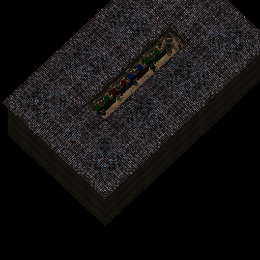
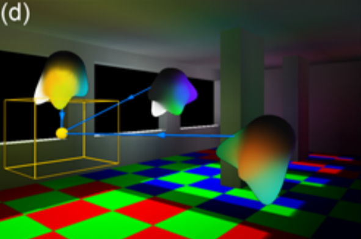

# Dynamic Diffuse Global Illumination for Web/Mobile Platforms
## Theory
[Real-Time Diffuse Global Illumination Using Radiance Hints](http://graphics.cs.aueb.gr/graphics/docs/papers/RadianceHintsPreprint.pdf)

## Demo
[Live video](https://youtu.be/7dbt_oMA4ts)

## Overview
Web/Mobile platforms don't have such high performance GPU compare to Desktop ones. So this article is mainly aimed for explaining **a High Performance Implementation** that targets to Web/Mobile platforms. It only requires a few low-cost scene-independent geometry for radiance computation, and does not require any additional rendering of the scene’s geometry except Reflective Shadow Map(RSM) generation which costs pretty much the same as shadow map dose. 
Method overview:
* Render RSM from the main Light source (e.g. the sun) perspective.
* Configure a group of small cubes to sample RSM and compute incoming radiance for the first light bounce and store the result to a volume texture(few 2D texture atlas to emulate each slice of 3D texture). If more bounces are requested, prepare a second set for interleaved radiance field update.
* Reconstructing Indirect Illumination from the volume texture. 

## Implementation
1. Rendering RSM from the main Light source (e.g. the sun) perspective.
    1. In order to get best result from RSM, we have to find the most necessary area from the main camera view that can be covered by RSM tightly. The whole process is very similar to cascaded shadow map that builds every cascades, here we only need the first cascade.

        

        The image above illustrates how cascade shadow map calculating light projections. As for RSM generation we set a user tweakable param named "GI Far Plane" to indicate how far of the main camera should see the GI effects, and how big the light frustum is. Here we only need the "near light frustum" from the image above.

        Procedure code for calculating the light ortho projection based on main camera: 
        ```c++
        Matrix4x4 constructRSMProjection(const Camera& mainCamera, const Light& light)
        {

            // Get the 8 points that representing main camera frustum near and far planes in World Space;
			 std::array<Vector4f,8>& original_cameraFrustumCorners_worldSpace = mainCamera.frustum.getCorners();
            
            // Compute new main camera frustum corners based on "GI Far Plane";
             std::array<Vector4f,8> split_cameraFrustumCorners_worldSpace = computeNewFrustumCornersBySplit(original_cameraFrustumCorners_worldSpace);
           
            //Compute geometry centroid of new main camera frustum corners;
            Vector4f cameraFrustumCenter_worldSpace = computeFrustumCenter(split_cameraFrustumCorners_worldSpace);

            //Transform geometry centroid of new main camera frustum corners to light space;
            Vector4f cameraFrustumCenter_lightSpace = MatrixTransform.transform(light.invertedWorldMatrix4x4, cameraFrustumCenter_worldSpace);

            //Compute the bounding sphere of the new main camera frustum
            float sphereRadius = -MAX_FLOAT;
			for (int i = 0; i < 8; i)
			{
				float dist = Vector4f.distance(cameraFrustumCenter_worldSpace, split_cameraFrustumCorners_worldSpace[i]);
				sphereRadius = std::max(sphereRadius, dist);
			}

			// Construct AxisAlignBox by centroid in world and bounding sphere radius. function params are:centerPoint, extentX, extentY, extentZ.
            // Used to calculate the volume cubes later.
            AxisAlignBox intersectedAAB;
            lightAAB.setByCenterExtents(cameraFrustumCenter_worldSpace,sphereRadius,sphereRadius,sphereRadius);

            // Construct AxisAlignBox by centroid in light space and bounding sphere radius. function params are:centerPoint, extentX, extentY, extentZ
            AxisAlignBox lightAAB;
            lightAAB.setByCenterExtents(cameraFrustumCenter_lightSpace,sphereRadius,sphereRadius,sphereRadius);

            //Build ortho projection based on lightAAB, function params are: left, right, bottom, top, near, far.
            return buildOrthoProjectionOffCenter(lightAAB.minX, lightAAB.maxX, lightAAB.minY, lightAAB.maxY, 0, lightAAB.extentZ);
        }
        ```
    2. Rendering RSM using projection matrix builded from previous step, before passing to the shader, make sure to multiply a invert matrix of light which need to be adjusted with position by offsetting away align with its z axis from scene's geometry bounds, otherwise it would collide with scene's geometry which may lead some scene's geometries been clipped from RSM.

         Procedure shader code for rendering all scene's geometries inside light frustum to RSM:

         ```glsl
         layout(location = 0) out vec4 fragmentOut0;
         layout(location = 1) out vec4 fragmentOut1;
         layout(location = 2) out vec4 fragmentOut2;
         
         //position in project space
         in vec4 v_positionWVP; 

         //normal in world space
         in vec3 v_normalW; 

         //light inverted normalized direction
         uniform vec3 u_lightDirW;
         //light color
         uniform vec3 u_lightDirW;
         void main()
         {
             // out put NDC depth packed to 32bit
             fragmentOut0 = pack8to32(v_positionWVP.z / v_positionWVP.w);
             
             // out put world Normal clamp to range 0~1;
             fragmentOut1 = vec4(v_normalW * 0.5 + 0.5, 1.0);

             float nDotL =  clamp(dot(v_normalW,u_lightDirW.xyz),0.0, 1.0);
             float3 diffuse = nDotL * lightColor * src.rgb;// src is diffuse color of geometry
             
             // out put geometry diffuse color after being lit by this light.
             fragmentOut2 = vec4(diffuse,1.0);
         }
         ``` 
         Result:

        * RSM Packed Depth Buffer

            

        * RSM Normal Buffer

            

        * RSM Flux Buffer

            

2. Constructing GI for the first bounce by building "volume geometry" that fit intersectedAAB and render to a "volume texture".

    1. Using a user tweakable param "volumeSize" to configure a big cube that has exactly same size as previously calculated intersectedAAB, it is formed by multiple small cubes with a same size, The larger volumeSize lead more accurate result. 

        **The cubes are only used for demonstrating, they are not used for rendering**

        * Demonstrating volumeSize = **2**. So the intersectedAAB contains **2 * 2 * 2** cubes;

            

        * Demonstrating volumeSize = **4**. So the intersectedAAB contains **4 * 4 * 4** cubes;

            

        * Demonstrating volumeSize = **8**. So the intersectedAAB contains **8 * 8 * 8** cubes;

            

    2. Building rendering geometry for computing incoming radiance from RSM. We split the big cube into slices along with z axis (blue axis showed in above images), for each slice it will store the computation result into a 2D texture. Finally we combine all slices together from near to far, and map it in to **a single 2D texture** which contain N slices from left to right.

        When volumeSize == 4:

         

        And output the result into **a single 2D texture**:

         

        So, **For N volumeSize we only need N quads (2N triangle)for constructing GI**. In most cases, **volumeSize = 64** is enough already. Procedure code to build N quads based on volumeSize:
        ```c++
        // Tweakable prams used for flipping UV, etc.
        unsigned int volumeSize = 4;

        float scaleX = 1.0f / volumeSize;
        float scaleY = 1.0f;
        float scaleZ = scaleX;
        float offsetX = scaleX;
        float offsetY = 0.0f;

        float halfOffset = 0.0f / volumeSize; // in cases where pixel don't align with texels, e.g. d3d9.
        float u, v, x, y, z, nz;
        int index = 0;
        //vertex layout is (u, v, index of each slice, x, y, z)
        //where x y z is the local coordinate of the big cube which its origin is the left bottom of the first slice.
        //if volumeSize didn't change we don't need to rebuild this geometry.
        std::vector<float> vertexVector;
        std::vector<int> indexVector;
        for (int i = 0; i < volumeSize; ++i)
        {
            float fi = static_cast<float>(i);

            nz = fi * scaleZ + halfOffset;

            u = 0.0f * scaleX + fi * offsetX;
            v = 0.0f * scaleY + fi * offsetY;
            x = (u - 0.5f) * 2.0f;
            y = (0.5f - v) * 2.0f;
            vertexVector.insert(vertexVector.end(), 
                { x, y, fi, 0.0f + halfOffset, 1.0f + halfOffset, nz });

            u = 1.0f * scaleX + fi * offsetX;
            v = 0.0f * scaleY + fi * offsetY;
            x = (u - 0.5f) * 2.0f;
            y = (0.5f - v) * 2.0f;
            vertexVector.insert(vertexVector.end(), 
                {x, y, fi,  1.0f + halfOffset, 1.0f + halfOffset, nz });

            u = 0.0f * scaleX + fi * offsetX;
            v = 1.0f * scaleY + fi * offsetY;
            x = (u - 0.5f) * 2.0f;
            y = (0.5f - v) * 2.0f;
            vertexVector.insert(vertexVector.end(), 
                { x, y, fi, 0.0f + halfOffset, 0.0f + halfOffset, nz });

            u = 1.0f * scaleX + fi * offsetX;
            v = 1.0f * scaleY + fi * offsetY;
            x = (u - 0.5f) * 2.0f;
            y = (0.5f - v) * 2.0f;
            vertexVector.insert(vertexVector.end(),
                { x, y,  fi, 1 + halfOffset, 0.0f + halfOffset, nz });

            indexVector.insert(indexVector.end(), 
                { index, index + 1, index + 2, index + 3, index + 2, index + 1 });

            index += 4;
        }
        ```
    3. Computing radiance field for the first bounce by sampling random location from RSM in a range which is tweakable pram used to define how far the indirect light should spread, for each random sampled position, we cast a ray to a random point inside current small cube(Radiance Hint Cell), so dot(ray, sampled normal) should be the diffuse factor of one of indirect light distributions, store it in Spherical Harmonics space and output by accumulating all rays, this should end with an approximation of radiance caching.

        

        **Yellow cell** is Radiance Hint Cell(small cube we configured previously); **Yellow point** is the geometry centroid fo the cell; **Cyan with arrow** is the sampled normal from RSM; **Cyan lines** are the ray mentioned above;**Green points** are random points inside the cell; **Red ones** are discarded as its geometric information are not stored in RSM.

        Procedure shader code for the first bounce:

        ```glsl
        vec2 computeUVFromPosition(vec2 positionScreen)                 
		{
			return positionScreen * vec2(0.5f,-0.5f) + 0.5f; // Map range from -1~1 to 0~1;
		}
        vec2 computeScreenPosFromUV(vec2 screenUV)
		{
			return (screenUV - 0.5 ) / vec2(0.5,-0.5); // Map range from 0~1 to -1~1;
		}	
        //vertex layout is (u, v, index of each slice, x, y, z)
        //where x y z is the local coordinate of the big cube which its origin is the left bottom of the first slice.
        vec2 flatUV = computeUVFromPosition(uv);
        vec3 ivoxelPos = vec3(x,y,z);
        vec3 rh_center_WS = rh_aab_min + ivoxelPos * rh_aab_extent; // Calculate the center of cell in world space by "big cube" world space Axis Aligned Box;
        vec4 rh_center_NDC = rsm_viewProj * vec4(rh_center_WS,1.0);
	    rh_center_NDC.xyz /=rh_center_NDC.w; // Transform center from world space in NDC space.
        vec2 rsm_center_uv = computeUVFromPosition(rh_center_NDC.xy);

        vec4 outR = vec4(0.0);
        vec4 outG = vec4(0.0);
        vec4 outB = vec4(0.0);

        float dist_min= 0.0;
	    float dist_max =0.0;

        //max_sample_kernel is tweakable param, 20 is enough in most cases.
        for (int i=0;i< max_sample_kernel;i++)
	    {
          
            vec3 random = computeRandom(i, flatUV); // get a random vector from a 3D noise map or compute in shader.
            
            //worldSpreadDistance is a tweakable value that used to indicate how far the indirect should spread in world space.
            //sampleRadius.x = worldSpreadDistance / bigCube.extentX;
            //sampleRadius.y = worldSpreadDistance / bigCube.extentY;
            vec2 rsm_uv_offset = random.x * sampleRadius; 
            vec2 rsm_uv = clamp(rsm_center_uv+ rsm_uv_offset,0.0, 1.0); // clamp the range of uv to 0~1
            
            float sampleDepth = unpack32(texture2D(rsm_depth_buffer,rsm_uv));// get the depth value from RSM depth buffer;

            //construct sample position in light NDC space, then transform back to world space.
            vec4 samplePos_WS = vec4 (computeScreenPosFromUV(rsm_uv),sampleDepth, 1.0);
            samplePos_WS = rsm_invViewProj * samplePos_WS;
            samplePos_WS.xyz /= samplePos_WS.w;

            // random position inside the cell. rh_cell_size = bigWorldSpaceAAB.extent / volumeSize
            vec3 rh_pos = rh_center_WS +  0.5 * random * rh_cell_size;

            // compute the "ray"
            vec3 v = rh_pos - samplePos_WS.xyz;
            float magnitude = length(v);
            
            // scaling distance with worldSpreadDistance;
            float dist = magnitude / worldSpreadDistance;
            
            // get sampled pixel diffuse color that is lit by light.
            vec4 sampleFlux = texture2D(rsm_flux_buffer,rsm_uv);
            sampleFlux.rgb *= lightIntensity;

            // value with 1 statement is true. used as workaround for if else statements.
            float backGroundFactor = signGreater(sampleFlux.a, 0.01);     
            float3 dir = v / magnitude;
            // discard dir if distance is to close and also discard if current sampled pixel is from frame buffer.
            dir *= signGreater(dist,0.01) * backGroundFactor; 
            
            // get sampled pixel normal
            vec3 sampleNormal_WS = texture2D(rsm_normal_buffer,rsm_uv).xyz * 2.0 - 1.0;
            
            // Calculate N dot L term and scale by distance^2 to get linear attenuation.
            float atten = saturate(dot(dir,sampleNormal_WS)) /(0.01+dist*dist);
            
            // optional occlusion testing by tessellating the "ray" into few steps to test against with scene geometry buffer to see if ray has been occluded by scene geometries.
            // it could be a similar process used for old SSAO
            atten *= occlusionTest(rh_pos,samplePos_WS.xyz,v);

            // Store maxDistance and minDistance in order to do more light bounces later
            dist_max= max(dist,dist_max);
            dist_min= min(dist,dist_min);

            vec3 outColor = sampleFlux.rgb * atten;
            
            vec4 sh = getSHBasis (dir); // choose a basis function or simply use vec4(dir,1.0) * vec4(0.488603,0.488603,0.488603,0.282095)
            
            // accumulating each color channel;
            outR += sh * outColor.r; 
            outG += sh * outColor.g; 
            outB += sh * outColor.b;
        }

        // SH weighted average
        float d = PI * max_sample_kernel;
        outR/= d;
        outG/= d;
        outB/= d;

        pixelShaderOutput0 = outR;
        pixelShaderOutput1 = outG;
        pixelShaderOutput2 = outB;
        pixelShaderOutput3 = vec4(dist_min,dist_max,0.0,1.0);// for further light bounces.
        ```
3. For N > 1 light bounces, for each light bounce pass we simply use the output from previous light bounce computation pass as input. So N light bounces will have N - 1 additional passes.

    

    Procedure shader code for the each of secondary bounces:
    
    ```glsl
    vec4 bLerp(vec4 x, vec4 y, float s) { return x*(1-s) + y * s; }; // manual interpolation;
    vec4 sampleAs3DTexture(sampler2D tex, vec3 texCoord, float size) 
    {
        float sliceSize = 1 / size;                         // space of 1 slice
        float slicePixelSize = sliceSize / size;              // space of 1 pixel
        float sliceInnerSize = slicePixelSize * (size - 1.0); // space of size pixels
        float zSlice0 = min(floor(texCoord.z * size), size - 1.0);
        float zSlice1 = min(zSlice0 + 1.0, size - 1.0);
        float xOffset = slicePixelSize * 0.5 + texCoord.x * sliceInnerSize;
        float s0 = xOffset + (zSlice0 * sliceSize);
        float s1 = xOffset + (zSlice1 * sliceSize);
        vec4 slice0Color = texture2D(tex, float2(s0, texCoord.y)); // hardware bilinear interpolation enbaled
        vec4 slice1Color = texture2D(tex, float2(s1, texCoord.y)); // hardware bilinear interpolation enbaled
        float zOffset = mod(texCoord.z * size, 1.0);
        return bLerp(slice0Color, slice1Color, zOffset);// emulating trilinear interpolation
    }

    // all variables have the same meaning as previous shader for the first bounce from RSM
    float scale =1.0;
    #for (int i=0;i<max_sample_kernel;i++)
	{
	    vec3 random = computeRandom(i, flatUV); // get a random vector from a 3D noise map or compute in shader.
		
        //  rh_cubeLength = sqrt(volumeSize * volumeSize + volumeSize * volumeSize + volumeSize * volumeSize);
		vec3 dir = normalize(random); 
		float dist = 0.5 /rh_cubeLength; //  sample distance in world space.
		dist += random.x * random.x; // emulating random.
		
        
        // sampleRHRadius = worldSpreadDistance / bigCube.sphereBoundRadius;
		vec3 uvw_new  = volumeSize * dir * dist * sampleRHRadius; // world space position inside sample radius.
		uvw_new /= rh_cubeLength; // normalizing to uv space.
		uvw_new += ivoxelPos; //offsetting by current pixel cell position to get the current uvw
		uvw_new.y = 1.0 - uvw_new.y; // invert the y of uv if needed.
		
        // Sample the result from previous pass, emulating texture3D function.
		vec4 rh_shr    = sampleAs3DTexture(rh_r_buffer,uvw_new,volumeSize);
		vec4 rh_shg    = sampleAs3DTexture(rh_g_buffer,uvw_new,volumeSize);
		vec4 rh_shb    = sampleAs3DTexture(rh_b_buffer,uvw_new,volumeSize);
		vec4 distances = sampleAs3DTexture(rh_a_buffer,uvw_new,volumeSize);
		
        // config if dist is inside of range from minDistance to maxDistance of the first bounce step
		float weight = (dist - distances.x) /(distances.y-distances.x);
		weight = clamp(weight, 0.0, 1.0);
		weight = 1.0 - weight;
		
        // discard if minDistance >= 1.0f;
		float visible = clamp(1.0 - distances.x, 0.0, 1.0);
		
        //vec3 decodeRH2RGB ( vec4 sh_r,  vec4 sh_g,  vec4 sh_b,  vec3 dir) 
        //{ 
        //     vec4 invBasis =  vec4 (1.023326, 1.023326, 1.023326, 0.886226);
        //    
        //    vec4 y = vec4(dir,1.0) * invBasis; 
        //    
        //    return vec3(dot(y,sh_r), dot(y,sh_g), dot(y,sh_b));
        //}
        // chose a decode function based on previous SH encode basis choice. or simply use mine above.
		vec3 GI = decodeRH2RGB (rh_shr, rh_shg, rh_shb, -dir); 
		GI *= weight * visible;
		scale += visible; // accumulating if visible

         // accumulating each color channel for output;
		vec4 sh = getSHBasis (dir); 
		outR += sh * GI.r; 
		outG += sh * GI.g; 
		outB += sh * GI.b;
	
	}
	
	scale = 12.567/(scale *max_sample_kernel) ; //4PI /scale as we sampled previous volume texture with hardware bilinear interpolation enabled.
		
	outR *= scale;
	outG *= scale;
	outB *= scale;
	
    // additive blending with result from previous bounces
	outR +=texture2D(rh_r_buffer,flatUV);
	outG +=texture2D(rh_g_buffer,flatUV);
	outB +=texture2D(rh_b_buffer,flatUV);

    // only output RGB, distance is not used as it has been calculated in the first light bounce pass already
    pixelShaderOutput0 = outR;
    pixelShaderOutput1 = outG;
    pixelShaderOutput2 = outB;
    ```
    
4. Reconstructing GI from previous calculated volume buffer which stored approximation of radiance field by using a similar Hemisphere Spherical Harmonics Lighting technique.

    

     Procedure shader code for Reconstructing GI in screen space quad:

     ```glsl
     // get scene's gemotry buffer in world space from gbuffer or whatever you prefer.
	vec3 normal_WS = calculateSceneWorldNormalFromGbuffer();
	vec3 pos_WS = calculateSceneWorldPositionFromGbuffer();
	
	// rh_aab_min is the min point in world space of "big cube" Axis Aligned box;
    // rh_aab_extent is the extents(sizeX, sizeY, sizeZ) in world space of "big cube" Axis Aligned box;
    // so this is the "origin" vector inside the "big cube", we will offset it to get sample position later.
	vec3 rh_center_NS = (pos_WS - rh_aab_min) /rh_aab_extent;
	
	// calculate world space TBN
	vec3 tangent_WS = normalize(cross(normal_WS,vec3(0.5,0.5,0.5)));
	vec3 binormal_WS = cross(tangent_WS,normal_WS);
	// we don't need to cross again to get tangent_WS as we have chosen the basic SH basis as vec4(0.488603,0.488603,0.488603,0.282095) 

	vec3 GI = 0.0;
	float denom = 0.05;
	float totalLength = length(rh_aab_extent/rh_cubeSize); // rh_cubeSize = volumeSize;
    // 4 sample taps is enough in practice, as after first sample tap, we rotate basis 80 degrees for each of rest taps.
	for( const float i = 0; i < 4; i++)
	{
		vec3 sampleDir = sampleBasis[i].x * tangent_WS + sampleBasis[i].y * normal_WS + sampleBasis[i].z * binormal_WS;// Rotate the sampleDir based on TBN, you can construct TBN matrix instead.
		
		vec3 sample_NS = rh_center_NS + (0.5* normal_WS + sampleDir)/rh_cubeSize;//offset sample position to get the actual one.
		
		// calculate contribution
		vec3 rh_pos  = sample_NS * rh_aab_extent + rh_aab_min; //get cell center in world space
		vec3 v = rh_pos - pos_WS;
		float magnitude = length(v);
		float dist = magnitude / totalLength;
		float contrib = signGreater(dist > 0.01); // discard if dist <= 0.01 to avoid some artifacts.
		
		vec3 uvw = sample_NS;
		uvw.y = 1.0 - uvw.y; // invert depends on graphics api

		// same function we used previously
		vec4 rh_shr    = sampleAs3DTexture(rh_r_buffer,uvw,rh_cubeSize); 
		vec4 rh_shg    = sampleAs3DTexture(rh_g_buffer,uvw,rh_cubeSize); 
		vec4 rh_shb    = sampleAs3DTexture(rh_b_buffer,uvw,rh_cubeSize); 
	
		GI+= contrib * decodeRH2RGB (rh_shr, rh_shg, rh_shb, -normal_WS); // decode has discussed previously.
		denom += contrib; 
	}
    // tweakable intensity
	GI*= intensity / denom;
     ```
## Show case

Here are some show cases that I used this implementation for flash player several years ago, and every scene **only used a single directional light**:


## Conclusion

Total cost: 

* 3 *  R8|G8|B8|A8 512*512 RSM integer textures with color buffer only. We don't need too large textures for RSM, the texel precision is not a big deal.

* 4 *  R16|G16|B16|A16 floating textures with color buffer only, volumeSize * volumeSize width and volumeSize height. if number of bounces > 1, then double this usage even for 4 bounces 8 bounces, as we are doing "ping pong rendering". In my show cases I used ( 2 * 4 textures, with width 32 * 32 , height 32).

* 1 RSM with scene geometry inside light frustum pass. 512 * 512 pixels.
* 1 construct gi pass with 2 * volumeSize triangles, in my show cases I used 32 volume size. 32* 32 * 32 pixels without over drawing.
* if Bounces > 1,  (Bounces -1 ) * secondary bounces pass with same volume geometry above. 32* 32 * 32 pixels without over drawing per pass.
* 1 reconstruction pass with space quad. size of frame buffer or custom light buffer pixels.